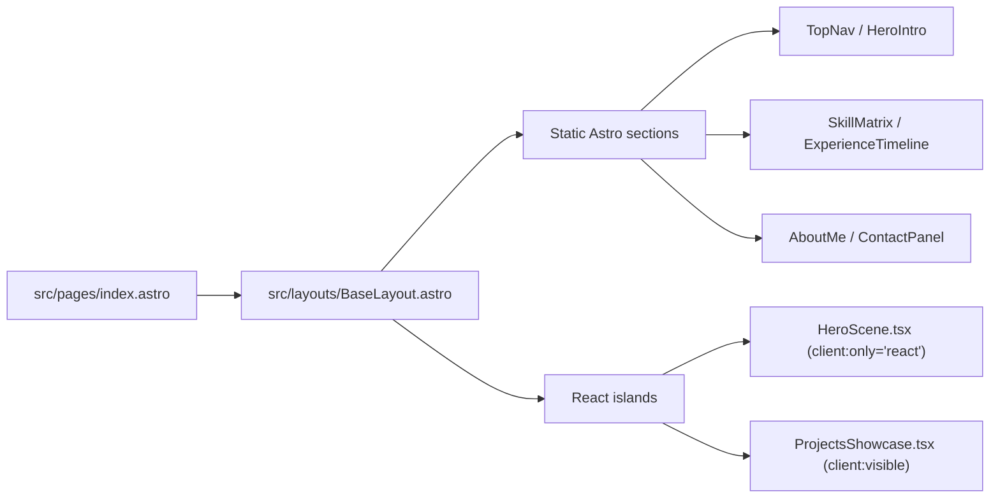
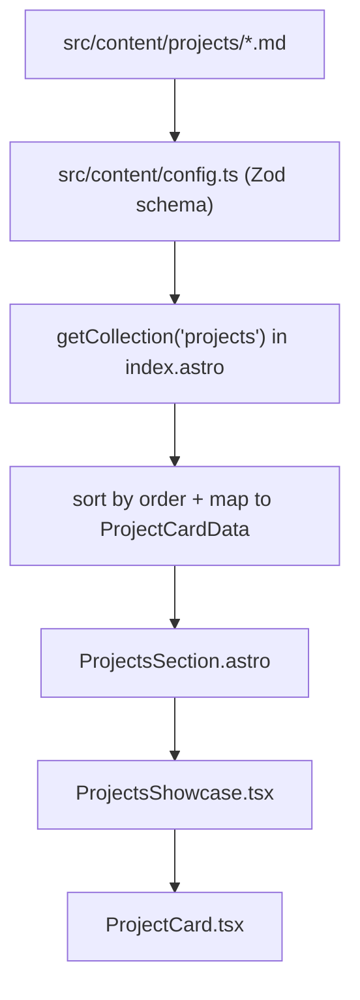
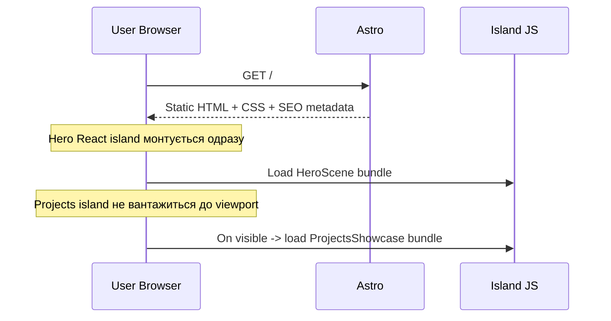

# Web Resume - Батурін Микита (Cyberpunk Interactive Portfolio)

Інтерактивне веб-резюме Middle Frontend Developer з акцентом на **доказову презентацію навичок** через реальні інженерні рішення: Astro Islands, React-інтерактив, 3D-сцена, контент-колекції, SEO, анімації, продуктивність.

## Зміст

- [1. Що це за проєкт і для чого](#1-що-це-за-проєкт-і-для-чого)
- [2. Ключова ідея архітектури](#2-ключова-ідея-архітектури)
- [3. Стек технологій](#3-стек-технологій)
- [4. Реалізовані фічі (поточний стан)](#4-реалізовані-фічі-поточний-стан)
- [5. Структура проєкту](#5-структура-проєкту)
- [6. Як запустити локально](#6-як-запустити-локально)
- [7. Як додати новий кейс у портфоліо](#7-як-додати-новий-кейс-у-портфоліо)
- [8. Інженерні рішення і trade-offs](#8-інженерні-рішення-і-trade-offs)
- [9. Performance / Accessibility / Quality](#9-performance--accessibility--quality)
- [10. План ініціативного розвитку (Roadmap+)](#10-план-ініціативного-розвитку-roadmap)
- [11. Деплой](#11-деплой)
- [12. Ліцензії та важливі примітки](#12-ліцензії-та-важливі-примітки)
- [13. Короткий підсумок](#13-короткий-підсумок)

---
## 1. Що це за проєкт і для чого

Це не просто "сторінка з досвідом". Це **демо-платформа**, яка показує:

- як я будую сучасний frontend від архітектури до релізу;
- як поєдную статичну швидкість (Astro) з точковою інтерактивністю (React islands);
- як працюю з UX-динамікою (Framer Motion + scroll-driven CSS + HUD/glitch ефекти);
- як презентую реальний production-кейс: [DND Codex Guide](https://www.dnd-codex.guide/).

### 1.1 Роль DND Codex Guide у резюме

`dnd-codex.guide` виступає центральним proof-of-work кейсом:

- високонавантажений інтерактивний довідник для D&D;
- frontend-частина на React/TypeScript/Vite SSR/PWA-підході;
- окремий backend API-слой (Django/DRF/JWT/Docker) як інфраструктурне доповнення.

Тобто це резюме одночасно є **документом компетенцій** і **вітриною продуктового мислення**.

---

## 2. Ключова ідея архітектури

Модель: **Static First + Islands for Interaction**.

- максимальний обсяг сторінки віддається статично (швидкий TTFB/First Paint);
- React підключається тільки там, де реально потрібна взаємодія;
- важкі частини (3D, motion-картки) ізольовані в islands.

### 2.1 Схема рендерингу



### 2.2 Схема даних про проєкти



### 2.3 Схема завантаження



---

## 3. Стек технологій

### 3.1 Core

- **Astro 5** - статичний каркас, маршрутизація, контент-колекції.
- **React 19 + ReactDOM 19** - islands для складної взаємодії.
- **TypeScript** - типізація компонентів і контент-моделей.
- **Tailwind CSS v4 (через @tailwindcss/vite)** - базовий CSS pipeline.

### 3.2 Interactivity / Visuals

- **Three.js**
- **@react-three/fiber**
- **@react-three/drei**
- **Framer Motion**

### 3.3 Контент і валідація

- **Astro Content Collections** + **Zod schema**.

### 3.4 Шрифти

- `Robocode` (локальний, головний UI/display шрифт) - `public/fonts/Robocode-ov3vx.ttf`
- `EuropeExtendedC` (локальний, для описових блоків) - `public/fonts/109-font.otf`
- fallback: `Exo 2`, `Russo One`, `Noto Sans`

---

## 4. Реалізовані фічі (поточний стан)

### 4.1 SEO / Metadata / Structured Data

Файл: `src/layouts/BaseLayout.astro`

- `meta` для description/theme-color/OG/Twitter;
- canonical URL;
- `schema.org Person` (JSON-LD);
- локаль сторінки `uk`;
- контактні дані та посилання на основний кейс.

### 4.2 3D Hero Scene

Файл: `src/components/react/HeroScene.tsx`

- Canvas на R3F;
- `Suspense` + кастомний loader;
- preloaded GLB (`/models/artifact.glb`);
- реакція на курсор через `useFrame(pointer)`;
- плаваюча модель + енергетичні кільця + sparkles;
- кольорокорекція під cyberpunk red HUD тему.

### 4.3 Інтерактивні Project Cards

Файли:

- `src/components/react/ProjectsShowcase.tsx`
- `src/components/react/ProjectCard.tsx`

Можливості:

- 3D tilt ефект по pointer-позиції;
- reveal деталей через `AnimatePresence`;
- motion-appearance on view;
- accent-колір на картку з markdown-контенту;
- посилання на проєкти/репозиторії.

### 4.4 Islands hydration strategy

- Hero: `client:only="react"` (3D блок ізольовано).
- Projects: `client:visible` (JS підвантажується після входу в viewport).

### 4.5 Cyberpunk UI система

Файл: `src/styles/global.css`

- червона термінальна палітра;
- scanlines / grain / vignette overlay;
- glitch-ефекти (`hud-glitch-burst`);
- sweep/scan ефекти панелей (`hud-panel-sweep`);
- hover/focus HUD-анімації для кнопок, nav, cards;
- scroll-driven reveal (`animation-timeline: view()`) + fallback;
- support `prefers-reduced-motion: reduce`.

### 4.6 Контент-керування через markdown

Папка: `src/content/projects`

Поточні записи:

- `dnd-codex-frontend.md`
- `dnd-codex-backend-api.md`
- `interactive-resume-lab.md`

Схема валідації: `src/content/config.ts`.

---

## 5. Структура проєкту

```text
.
|- public/
|  |- favicon.ico
|  |- favicon.svg
|  |- fonts/
|  |  |- 109-font.otf
|  |  |- Robocode-ov3vx.ttf
|  |- models/
|     |- artifact.glb
|- src/
|  |- assets/
|  |  |- models/artifact.glb
|  |  |- background.svg
|  |  |- README.md
|  |- components/
|  |  |- astro/
|  |  |  |- TopNav.astro
|  |  |  |- HeroIntro.astro
|  |  |  |- HeroSection.astro
|  |  |  |- SkillMatrix.astro
|  |  |  |- ExperienceTimeline.astro
|  |  |  |- ProjectsSection.astro
|  |  |  |- AboutMe.astro
|  |  |  |- ContactPanel.astro
|  |  |- react/
|  |     |- HeroScene.tsx
|  |     |- ProjectsShowcase.tsx
|  |     |- ProjectCard.tsx
|  |- content/
|  |  |- config.ts
|  |  |- projects/
|  |     |- dnd-codex-frontend.md
|  |     |- dnd-codex-backend-api.md
|  |     |- interactive-resume-lab.md
|  |- layouts/
|  |  |- BaseLayout.astro
|  |- pages/
|  |  |- index.astro
|  |- styles/
|     |- global.css
|- astro.config.mjs
|- package.json
|- tsconfig.json
|- README.md
```

---

## 6. Як запустити локально

### 6.1 Вимоги

- Node.js 20+
- npm 10+

### 6.2 Команди

```bash
npm install
npm run dev
```

Локальний сервер: `http://localhost:4321`

Production build:

```bash
npm run build
npm run preview
```

---

## 7. Як додати новий кейс у портфоліо

1. Створи новий файл у `src/content/projects/*.md`.
2. Дотримуйся frontmatter-схеми:

```yaml
order: 4
title: "Назва проєкту"
summary: "Короткий опис"
period: "2026"
url: "https://example.com"
repo: "https://github.com/..." # optional
tags:
  - "React"
  - "TypeScript"
highlight:
  - "Ключове досягнення 1"
  - "Ключове досягнення 2"
accent: "#ff4a61"
```

3. Запусти `npm run dev` або `npm run build` для перевірки.

---

## 8. Інженерні рішення і trade-offs

### 8.1 Чому Astro + React islands

- швидкий стартовий рендер (більшість сторінки = static);
- контрольований JS payload;
- ізоляція складної інтерактивності в окремі islands.

### 8.2 Чому Three.js саме в Hero

- 3D використовується як візуальний якір першого екрану;
- бізнес-цінність: демонстрація практичної експертизи у rich UI.

### 8.3 Поточний компроміс

- chunk `HeroScene` великий (очікувано через three/r3f stack);
- оптимізується через подальше chunking/lazy strategies.

---

## 9. Performance / Accessibility / Quality

### 9.1 Performance (що вже зроблено)

- Islands hydration лише за потребою;
- preload 3D asset;
- static-first rendering;
- контент через markdown без runtime API-запитів.

### 9.2 Accessibility (що вже зроблено)

- semantic landmarks/sections;
- `aria-label` у навігації;
- `prefers-reduced-motion` fallback;
- фокус-стани на інтерактивних елементах.

### 9.3 Що планується для якості

- Lighthouse CI в пайплайні;
- автоматичний a11y-аудит (axe);
- візуальні regression-тести для UI theme.

---

## 10. План ініціативного розвитку (Roadmap+)

### 10.1 Product / UX

- мультимовність `uk/en` з перемикачем локалі;
- command palette (hotkeys + швидка навігація по секціях);
- інтерактивний skill-map (граф залежностей між технологіями);
- timeline achievements з фільтрами за роками/стеком.

### 10.2 Technical depth

- manual chunk strategy для 3D island;
- AVIF/WebP pipeline + glTF оптимізація (`draco`, meshopt);
- edge-friendly SSR/ISR варіант розгортання;
- інтеграція telemetry подій (без інвазивного трекінгу).

### 10.3 Content & Hiring flow

- downloadable PDF CV, синхронізований з контентом сайту;
- секція "case studies" (архітектурні розбори рішень);
- contact funnel з anti-spam логікою;
- "availability status" блок для швидкого найму.

### 10.4 Wow-фічі (далі, коли база стабільна)

- WebGL shader transitions між секціями;
- інтерактивний "Terminal Mode" (консольний перегляд резюме);
- мікро-демки алгоритмів оптимізації рендеру прямо на сторінці;
- AI-powered FAQ про досвід і стек (локальна база знань).

---

## 11. Деплой

Проєкт готовий до деплою на Vercel/Netlify як static build.

Базовий flow:

1. Push у `main`.
2. Build command: `npm run build`.
3. Output directory: `dist`.

---

## 12. Ліцензії та важливі примітки

- Локальні шрифти додані у `public/fonts` для контрольованого рендерингу.
- Для `Robocode` у наданому `info.txt` зазначено: `license: Demo` - перед публічним/комерційним використанням варто перевірити умови ліцензії.

---

## 13. Короткий підсумок

Це production-grade веб-резюме, яке демонструє не тільки "що я знаю", а **як саме я приймаю технічні рішення**, проектую UX, тримаю баланс між ефектністю та продуктивністю, і доводжу компетенцію реальними кейсами.


