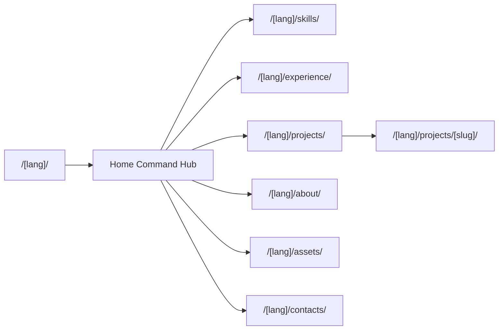
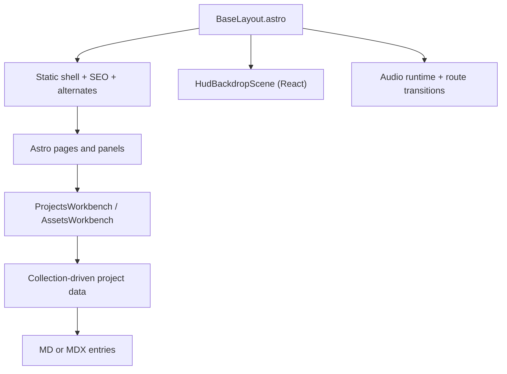
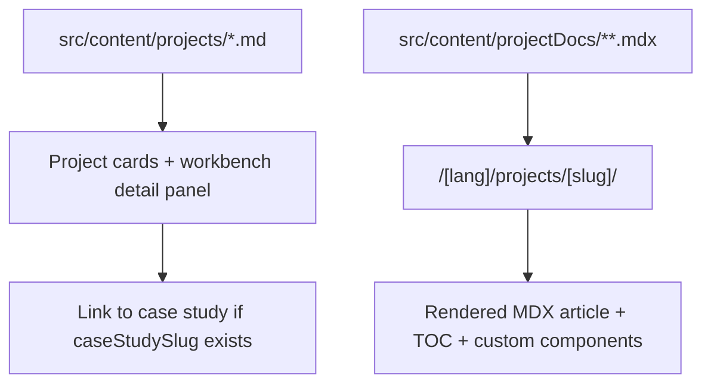

# Web Resume - Mykyta Baturin

Інтерактивне веб-резюме у форматі **cyberdeck / command hub**, де кожен розділ відкривається як окремий вузол:
навички, досвід, проєкти, асети, контакти. Це вже не одна довга landing-сторінка, а multipage-інтерфейс з
workbench-модулями, 3D-фоном, glitch-route transitions, audio-feedback і контентом на Astro collections.

## Зміст

- [1. Що це за проєкт](#1-що-це-за-проєкт)
- [2. Як зараз позиціонується DND Codex Guide](#2-як-зараз-позиціонується-dnd-codex-guide)
- [3. Архітектурна модель сайту](#3-архітектурна-модель-сайту)
- [4. Що вже реалізовано](#4-що-вже-реалізовано)
- [5. MDX і project docs](#5-mdx-і-project-docs)
- [6. Стек](#6-стек)
- [7. Структура проєкту](#7-структура-проєкту)
- [8. Запуск локально](#8-запуск-локально)
- [9. Як додати новий проєкт або case study](#9-як-додати-новий-проєкт-або-case-study)
- [10. Інженерні trade-offs](#10-інженерні-trade-offs)
- [11. Підсумок](#11-підсумок)

## 1. Що це за проєкт

<<<<<<< Updated upstream
Це **демо-платформа**, яка показує:
=======
Це proof-of-work інтерфейс для frontend engineer, де важливо показати не тільки список технологій, а **спосіб
мислення і спосіб збірки продукту**:
>>>>>>> Stashed changes

- static-first каркас на Astro;
- React islands лише в тих місцях, де потрібен runtime;
- окремі multipage-маршрути під різні технічні вузли;
- контентні колекції для коротких кейсів і окреме MDX-дерево для великих досьє;
- окремий MDX-шар для багатших project docs;
- єдина HUD-візуальна система з фоном, маршрутизаційними ефектами й аудіо-подіями.

## 2. Як зараз позиціонується DND Codex Guide

`DND Codex Guide` у цьому резюме більше не описується як “центральний” чи “основний” проєкт.

Правильніше:

- це поточний **найповніше оформлений live-case**;
- це кейс, де вже видно **React/Vite SSR основу**, **Astro pilot**, **MDX content pipeline** і **окремий backend API**;
- це не “єдиний справжній проєкт”, а просто найбільш детально задокументований на цей момент.

Саме тому для нього тепер є не тільки запис у `projects`, а й окрема MDX-сторінка технічного досьє.

## 3. Архітектурна модель сайту

### 3.1 Command-hub routing



### 3.2 Runtime split



### 3.3 Контентний потік для проєктів



## 4. Що вже реалізовано

### 4.1 Multipage-подача замість однієї стрічки

- `home` став навігаційним вузлом;
- кожен розділ має окремий URL і власний banner/context;
- `projects` та `assets` працюють як окремі workstation-модулі.

### 4.2 HUD runtime

Файл: `src/layouts/BaseLayout.astro`

- 3D background scene як окремий React runtime;
- route transition overlay для внутрішніх переходів;
- збереження вибраної мови;
- audio priming і звуки для `hover`, `confirm`, `route`, `panel-open`, `panel-close`.

### 4.3 Projects Workstation

Файли:

- `src/components/react/ProjectsWorkbench.tsx`
- `src/lib/projects.ts`
- `src/content/projects/*.md`

Можливості:

- список проєктів з коротким досьє;
- права detail-панель зі стеком, роллю, архітектурою й impact;
- link-out на live;
- link на окремий case-study route, якщо проєкт має `caseStudySlug`.

### 4.4 Assets Workstation

Окремий модуль для reusable UI/interaction напрацювань:

- preview;
- use-cases;
- кодові фрагменти;
- структуровані описи.

### 4.5 Мультимовність

- `uk` та `en`;
- окремі маршрути на кожну мову;
- language switch;
- `alternate` links;
- окремі локалізовані тексти в `siteCopy` та `pageCopy`.

### 4.6 Візуальна система

Файл: `src/styles/global.css`

- кастомні локальні шрифти;
- cyberpunk / HUD палітра;
- scanlines / grain / vignette overlays;
- glitch-анімації;
- route wipe;
- адаптивність і `prefers-reduced-motion`.

## 5. MDX і project docs

MDX тут доданий не для “блогу заради блогу”, а для **багатших технічних досьє**.

Що це дає:

- сторінки типу `/uk/projects/dnd-codex-guide/`;
- таблиці, кодові блоки, callout-секції;
- sticky TOC, який збирається з headings;
- Astro-компоненти прямо всередині MDX.

### 5.1 Що використовується

- `@astrojs/mdx`
- `import.meta.glob()` для локалізованих MDX case-study entry
- dynamic route `src/pages/[lang]/projects/[slug].astro`
- кастомні MDX-компоненти:
  - `SignalCallout.astro`
  - `MetricsGrid.astro`
  - `FeatureTiles.astro`

### 5.2 Навіщо це окремо від `projects/*.md`

`projects/*.md` лишаються короткими структурованими профілями для workstation-карток.

`projectDocs/**/*.mdx` використовуються для великих case studies, де потрібні:

- багатий опис;
- таблиці;
- код;
- секційна навігація;
- більш “редакторський” формат.

## 6. Стек

### 6.1 Core

- **Astro 5**
- **React 19**
- **TypeScript**
- **Tailwind CSS v4**

### 6.2 Motion / Runtime

- **Framer Motion**
- **Three.js**
- **@react-three/fiber**
- **@react-three/drei**

### 6.3 Content

- **Astro Content Collections**
- **Zod schema**
- **Markdown**
- **MDX**

### 6.4 UX mechanics

- custom route transition runtime;
- audio interaction bus;
- sticky workbench panels;
- content-driven page generation.

## 7. Структура проєкту

```text
.
|- public/
|  |- fonts/
|  |- sounds/
|- src/
|  |- components/
|  |  |- astro/
|  |  |  |- TopNav.astro
|  |  |  |- PageBanner.astro
|  |  |  |- HomeModules.astro
|  |  |  |- project-docs/
|  |  |     |- SignalCallout.astro
|  |  |     |- MetricsGrid.astro
|  |  |     |- FeatureTiles.astro
|  |  |- react/
|  |     |- HudBackdropScene.tsx
|  |     |- ProjectsWorkbench.tsx
|  |     |- AssetsWorkbench.tsx
|  |- content/
|  |  |- config.ts
|  |  |- projects/
|  |  |  |- dnd-codex-frontend.md
|  |  |  |- dnd-codex-backend-api.md
|  |  |  |- interactive-resume-lab.md
|  |  |- projectDocs/
|  |     |- uk/dnd-codex-guide.mdx
|  |     |- en/dnd-codex-guide.mdx
|  |- i18n/
|  |  |- siteCopy.ts
|  |  |- pageCopy.ts
|  |- layouts/
|  |  |- BaseLayout.astro
|  |- lib/
|  |  |- projects.ts
|  |  |- projectDocs.ts
|  |  |- routes.ts
|  |- pages/
|  |  |- [lang]/index.astro
|  |  |- [lang]/[page].astro
|  |  |- [lang]/projects/[slug].astro
|  |- styles/
|     |- global.css
|     |- project-docs.css
|- astro.config.mjs
|- package.json
|- README.md
```

## 8. Запуск локально

### 8.1 Вимоги

- Node.js 20+
- npm 10+

### 8.2 Команди

```bash
npm install
npm run dev
```

Локально:

```text
http://localhost:4321
```

Production build:

```bash
npm run build
npm run preview
```

## 9. Як додати новий проєкт або case study

### 9.1 Короткий проєкт у workstation

Створи файл у `src/content/projects/`.

Поля:

```yaml
order: 4
title:
  uk: "Назва"
  en: "Title"
summary:
  uk: "Короткий опис"
  en: "Short summary"
period:
  uk: "2026"
  en: "2026"
url: "https://example.com"
tags:
  - "React"
  - "TypeScript"
highlight:
  uk:
    - "Пункт 1"
    - "Пункт 2"
  en:
    - "Point 1"
    - "Point 2"
accent: "#ff4a61"
caseStudySlug: "my-project"
```

### 9.2 Розгорнуте досьє на MDX

Створи локалізовані файли:

- `src/content/projectDocs/uk/my-project.mdx`
- `src/content/projectDocs/en/my-project.mdx`

Мінімальний frontmatter:

```yaml
slug: "my-project"
projectSlug: "slug-з-папки-projects"
title: "Назва case study"
summary: "Опис сторінки"
eyebrow: "Case Study // XXX"
node: "NODE // XXX"
teaser: "Коротке позиціонування"
```

Потім:

1. додай `caseStudySlug` у відповідний `projects/*.md`;
2. запусти `npm run build`;
3. перевір маршрут `/uk/projects/my-project/` і `/en/projects/my-project/`.

## 10. Інженерні trade-offs

### 10.1 Чому не все на React

Бо частина сайту є контентною і виграє від Astro routing + нижчої вартості гідрації.

### 10.2 Чому не все на MDX

Бо workstation-картки краще живуть у короткій схемі frontmatter + typed profile, ніж у великих статтях.

### 10.3 Чому не один gigantic README-кейс у межах картки

Бо detail-panel і case-study page вирішують різні задачі:

- panel = швидкий перегляд;
- MDX page = глибоке технічне досьє.

### 10.4 Чому DND Codex подається саме так

Бо зараз це кейс, де видно не тільки UI, а й migration thinking:

- React/Vite SSR продукт;
- Astro knowledge routes;
- MDX content pipeline;
- окремий backend.

## 11. Підсумок

Це резюме показує не просто “що я знаю”, а **як я організовую систему**:

- розділяю static/content і interactive/runtime шари;
- не боюся multipage-архітектури там, де вона краща за single-scroll;
- виношу довгі технічні кейси в MDX;
- роблю інтерфейс виразним, але підпорядкованим структурі, а не навпаки.
